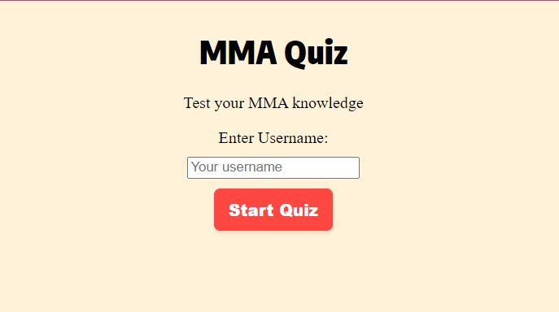
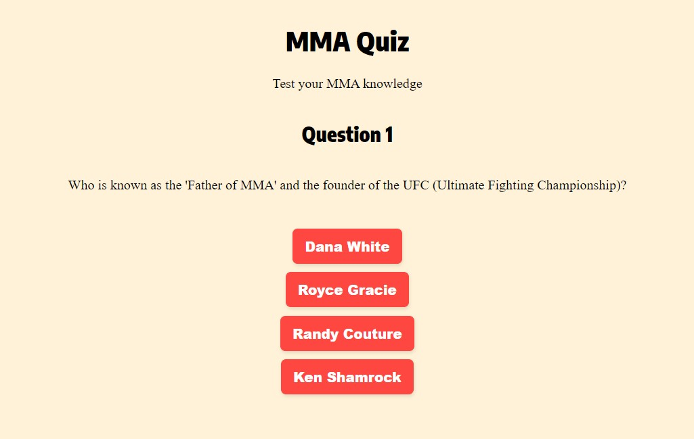
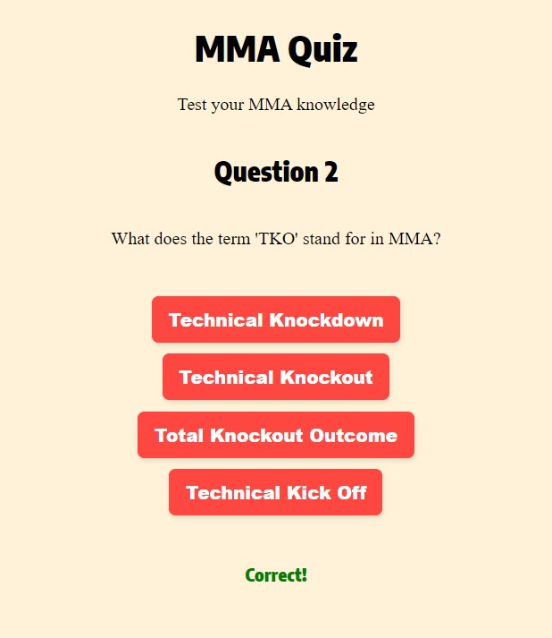
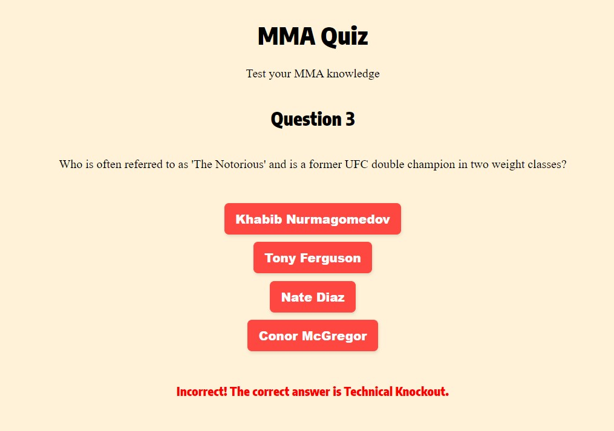
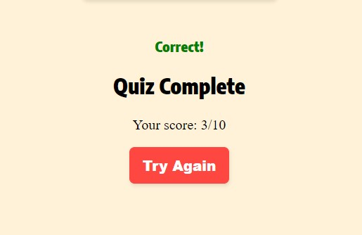
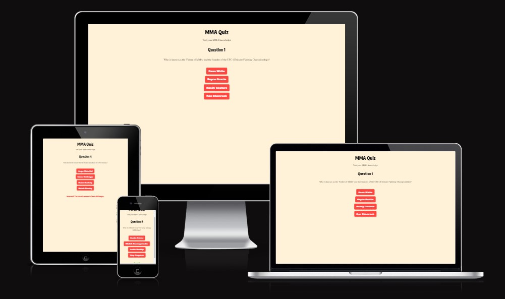
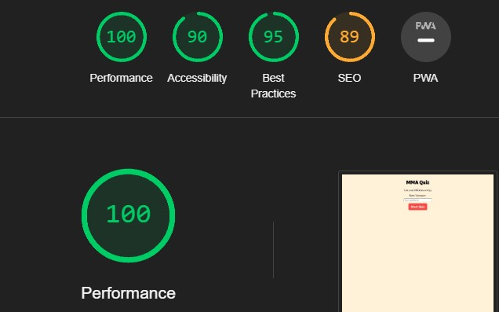

# MMA Quiz

This repository contains code for an interactive MMA (Mixed Martial Arts) Quiz website. The quiz is designed to test users' knowledge about various aspects of MMA, including fighters, techniques, and historical facts.

## Table of Contents

- [MMA Quiz](#mma-quiz)
  - [Table of Contents](#table-of-contents)
  - [Description](#description)
  - [Features](#features)
  - [Technologies Used](#technologies-used)
  - [Usage](#usage)
  - [Testing](#testing)
    - [Overview](#overview)
    - [Test Cases](#test-cases)
    - [Tools Used](#tools-used)
    - [Test Results](#test-results)
  - [Deployment](#deployment)
  - [Media](#media)
  - [HTML, CSS and JS Validated](#html-css-and-js-validated)

## Description

The MMA Quiz website is an interactive platform that presents a series of questions related to MMA, allowing users to test their knowledge in this field. It offers multiple-choice questions covering various topics such as famous fighters, historical events, and fighting techniques.

## Features

- Multiple-choice quiz format
- Questions covering a wide range of MMA-related topics
- Immediate feedback for correct and incorrect answers
- Final score display upon completing the quiz
- "Try Again" functionality to restart the quiz

## Technologies Used

- HTML5
- CSS3
- JavaScript

## Usage

- **Start Quiz**: Enter a username and click the "Start Quiz" button to begin the quiz.
- **Answer Questions**: Select answers to the multiple-choice questions provided.
- **Feedback**: Immediate feedback for correct and incorrect answers.
- **End of Quiz**: After answering all questions, view your final score and an option to try the quiz again.

## Testing

### Overview

The MMA Quiz underwent testing to ensure smooth functionality and responsiveness across different devices and browsers. The testing phase focused on assessing the user interface, functionality, and overall user experience.

### Test Cases

- **Responsiveness**: Checked the website's responsiveness on various devices using manual testing and browser dev tools.
- **Cross-Browser Compatibility**: Verified compatibility across multiple browsers such as Chrome, Firefox, Safari, and Edge.
- **Feature Testing**: Ensured that all quiz features (question presentation, answer selection, feedback, and score display) function as expected.
- **Usability Testing**: Involved real users to assess the ease of use and navigation of the quiz.

### Tools Used

- **Google Chrome DevTools**: Inspected elements, debugged, and tested responsiveness.
- **Manual Testing**: Thoroughly checked the user interface, functionalities, and behavior manually.

### Test Results

The project successfully passed all test cases, demonstrating consistent performance across different devices and browsers. Reported issues were addressed and resolved.

## Deployment

The project was developed using local development environments and deployed using GitHub Pages.

The deployed MMA Quiz website can be accessed via the following link: [MMA Quiz](https://yourusername.github.io/mma-quiz)

## Media

Add any relevant screenshots or media showcasing the quiz interface.

## HTML, CSS and JS Validated

Validated all HTML, CSS and JavaScript documents for standards compliance.
