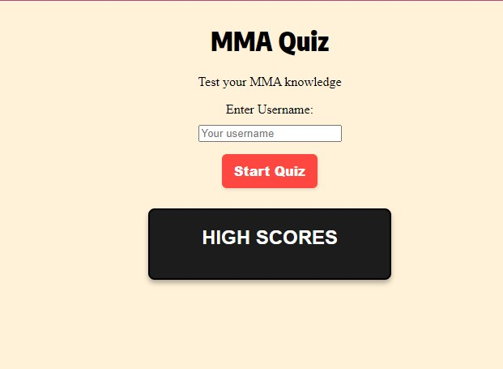
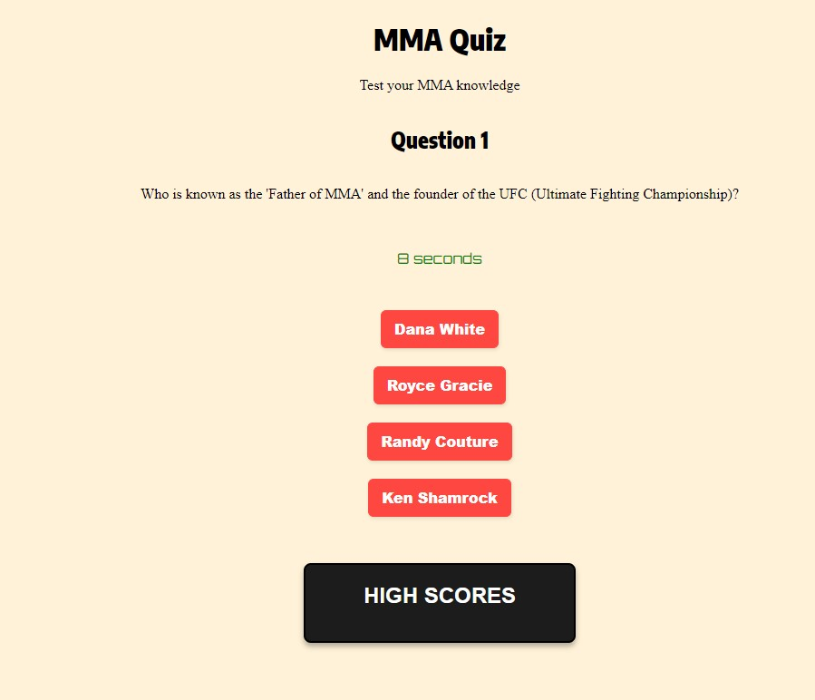
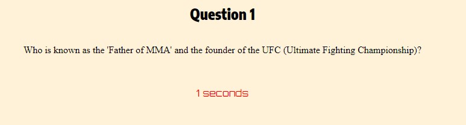
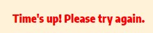
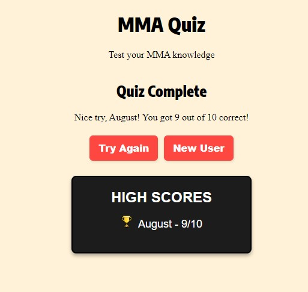
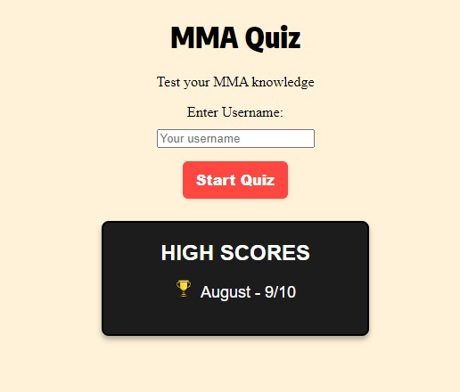
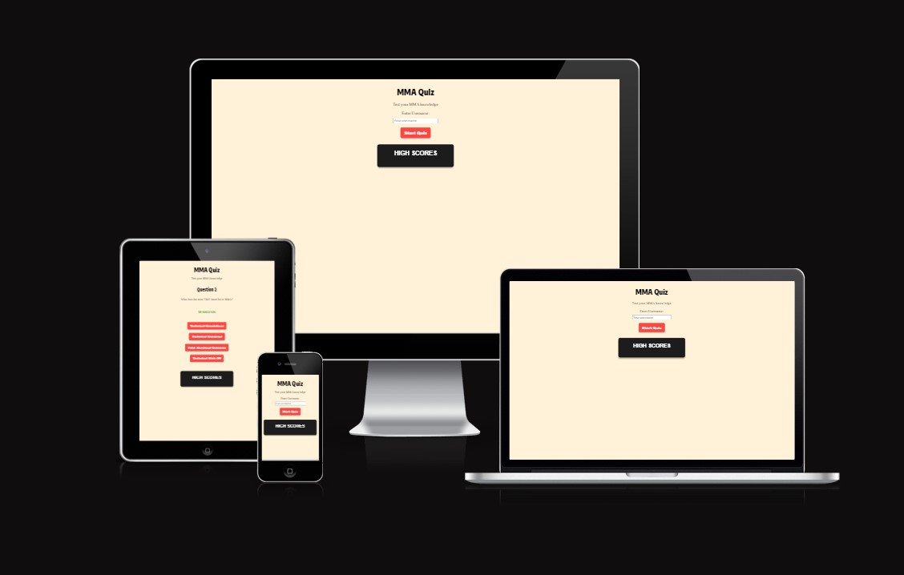
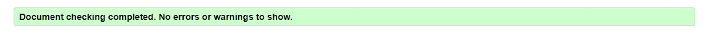
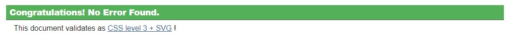

# MMA Quiz

This project is an interactive Mixed Martial Arts (MMA) Quiz designed to challenge and educate users on various aspects of MMA, including fighters, techniques, and historical events. It aims to provide an engaging learning experience for MMA enthusiasts of all levels.

# Table of Contents

- [Introduction](#introduction)
- [User/Owner Stories](#userowner-stories)
  - [User Stories](#user-stories)
  - [Owner Stories](#owner-stories)
- [Features](#features)
  - [Engaging Quiz Format](#engaging-quiz-format)
  - [Timed Questions for Added Excitement](#timed-questions-for-added-excitement)
  - [User Experience Enhancements](#user-experience-enhancements)
  - [Intuitive Design and Accessibility](#intuitive-design-and-accessibility)
  - [Performance and Compatibility](#performance-and-compatibility)
  - [Educational Value](#educational-value)
- [Technologies Used](#technologies-used)
- [Design](#design)
- [Usage](#usage)
- [Testing](#testing)
  - [Manual Testing Steps](#manual-testing-steps)
  - [Test Cases](#test-cases)
- [Bugs Fixed](#bugs-fixed)
  - [High Score Display at Start](#high-score-display-at-start)
  - [Quiz Restarting Unexpectedly](#quiz-restarting-unexpectedly)
  - [Unpredictable Quiz Behavior Due to Timer Expiry](#unpredictable-quiz-behavior-due-to-timer-expiry)
- [Deployment Guide for GitHub Pages](#deployment-guide-for-github-pages)
  - [Initial Setup and Customization](#initial-setup-and-customization)
  - [Enabling GitHub Pages Deployment](#enabling-github-pages-deployment)
  - [Continuous Deployment](#continuous-deployment)
- [Credits](#credits)
- [Media](#media)
- [HTML, CSS and JS Validated](#html-css-and-js-validated)

## Introduction

The MMA Quiz website is an interactive platform designed to test users' knowledge through multiple-choice questions related to Mixed Martial Arts (MMA). This project aims to cater to MMA enthusiasts and provide an engaging way to learn about the sport's history, key figures, and techniques.

## User/Owner Stories

### User Stories

1. **As a casual MMA fan,** I want to take a quiz that adjusts to my level of knowledge, so I can enjoy learning without feeling overwhelmed.
2. **As a dedicated MMA enthusiast,** I wish to challenge my understanding of detailed historical events and fighter profiles to validate my expertise.
3. **As a newcomer to MMA,** I need a way to learn about the sport in an engaging manner, so that I can become more interested and informed about MMA.
4. **As someone interested in trivia,** I'm looking for a quiz that provides immediate feedback, so I can learn from my mistakes and improve my knowledge.
5. **As a competitive user,** I want to see my scores and compare them with high scores, so I can have a goal to strive towards and a way to measure my improvement.

### Owner Stories

1. **As the project owner,** I aim to create an accessible and educational platform that serves both hardcore MMA fans and newcomers by providing a comprehensive quiz that covers a wide range of topics within MMA.
2. **As a developer,** I want to implement responsive design principles to ensure the quiz is accessible on any device, enhancing the user experience for everyone, regardless of how they access the site.
3. **As a content creator,** my goal is to compile a quiz that not only tests users' current knowledge but also educates them on aspects of MMA they might not be familiar with, enriching their overall understanding of the sport.
4. **As an advocate for learning,** I seek to design the feedback system in such a way that it encourages users to learn from their mistakes and motivates them to improve their scores through repeated attempts.
5. **As an MMA community member,** I wish to foster a deeper appreciation and understanding of MMA through an interactive quiz, promoting the sport and engaging with its fanbase in a meaningful way.

## Features

The MMA Quiz website offers a range of features designed to engage users, test their knowledge, and provide a seamless experience across devices. Here's an enhanced breakdown of the core features aligned with the project's goals and capabilities:

### Engaging Quiz Format

- **Curated Question Sets:** The quiz includes a carefully selected array of questions that cover a broad spectrum of MMA topics, from fighter histories and event milestones to technical fighting techniques. This variety ensures that both new fans and seasoned enthusiasts will find the quiz challenging and informative.
- **Immediate Feedback Mechanism:** After each question, users receive instant feedback indicating whether their answer was correct or incorrect, along with the correct answer for educational purposes. This immediate response system is designed to aid in learning and retention by providing real-time correction and reinforcement.

### Timed Questions for Added Excitement

- **10-Second Question Timer:** Each quiz question comes with a 10-second timer. Users must select their answer within this timeframe, adding a layer of excitement and urgency to the quiz. This feature tests not only the user's MMA knowledge but also their ability to think and react quickly.
- **Timer Expiry Action:** If the timer runs out before the user selects an answer, the quiz automatically restarts the quiz as a missed opportunity, ensuring that they are actively participating and challenging them to improve their speed and knowledge for a better score in future attempts.

### User Experience Enhancements

- **Progressive Difficulty:** While the quiz does not dynamically adjust its difficulty in real-time, the questions are arranged to balance between introductory and advanced levels, catering to a wide audience range.
- **Quiz Restart and User Retention:** Users have the ability to restart the quiz or try again after completing all questions. This "Try Again" feature encourages repeated engagement, allowing users to improve their knowledge and scores through multiple attempts.

### Intuitive Design and Accessibility

- **Responsive Design:** The quiz is built with a mobile-first approach, ensuring that it functions seamlessly across a range of devices, including desktops, tablets, and smartphones. The layout adjusts to fit the screen size, providing an optimal viewing experience without compromising functionality.
- **Simple Navigation:** The user interface is designed for ease of use, with clear instructions, a minimalistic layout, and intuitive controls. This simplicity aids in keeping the user focused on the quiz content rather than navigating the site.

### Performance and Compatibility

- **Fast Load Times:** The website is optimized for speed, with minimal use of heavy graphics or scripts that could slow down page loading. This ensures a smooth experience even on slower internet connections.
- **Cross-Browser Support:** Compatibility testing has been conducted across major web browsers to guarantee that the quiz operates consistently, regardless of the user's browser choice.

### Educational Value

- **Comprehensive Coverage:** The quiz questions span a wide array of MMA knowledge areas, making it a valuable tool for both learning and testing one's understanding of the sport.
- **Validation and Learning:** By providing correct answers immediately after each question, the quiz serves as an educational tool, allowing users to learn from their mistakes and gain new insights into MMA.

These features are meticulously designed to ensure that the MMA Quiz website is not only a test of knowledge but also an engaging and educational platform for MMA enthusiasts at all levels. The focus on user experience, accessibility, and educational value positions the quiz as a valuable resource for anyone looking to deepen their understanding of MMA.

## Technologies Used

- **HTML5**
- **CSS3**
- **JavaScript**

## Design

The design of the MMA Quiz website is focused on providing an intuitive and user-friendly experience. Key design considerations include:

#### Color Theme
- **Background Color (Body):** `#FFF2D8` - This light, neutral background color enhances readability and contrasts well with the content displayed on the page.
- **Button Color:** `#FF4742` - The vibrant red color chosen for buttons adds a bold and attention-grabbing element to the interface, encouraging user interaction.
- **Timer Indicator:** The timer bar changes color dynamically during the countdown, transitioning from green to red as the time runs out, providing visual cues to the user.

#### Fonts
- **Heading Font:** `Cormorant Garamond` - This serif font adds a touch of sophistication to headings, contributing to a polished and professional appearance.
- **Body Text Font:** `Encode Sans Condensed` - As a condensed sans-serif font, Encode Sans Condensed offers a modern and streamlined look for body text, ensuring clarity and readability.

#### Layout
- **Flexbox Layout:** The use of Flexbox CSS for layout ensures that elements are properly aligned and responsive across different screen sizes. This layout approach facilitates centering elements both vertically and horizontally, enhancing the overall visual balance of the page.
- **Header and Main Sections:** The header section prominently displays the quiz title and introductory message, while the main section contains the quiz questions, feedback, and score display. This clear separation of content helps users navigate the quiz interface intuitively.

## Usage

1. **Start Quiz:** Users enter their username and click the "Start Quiz" button.
2. **Answer Questions:** Select answers from the multiple-choice options.
3. **Feedback:** Receive immediate feedback after each question.
4. **End of Quiz:** View your final score and choose to retry the quiz or enter as a new user.

## Testing

### Manual Testing Steps

- **Link Clicks:** Verify that all navigation links work correctly.
- **Form Submission:** Check the quiz start functionality by submitting a username.
- **Responsive Design:** Test on various devices to ensure compatibility and responsiveness.

### Test Cases

| Test Case                | Expected Outcome          | Result  |
|--------------------------|---------------------------|---------|
| Start quiz without username | Prompt to enter username | Passed  |
| Answer all questions    | Display final score       | Passed  |
| Achieving a Perfect Score| Record user's name beside the trophy icon if they are the first to achieve a perfect score| Passed  |
| Responsive design check | Correct display on all device sizes | Passed |
| Cross-browser compatibility | Consistent performance across browsers | Passed |
| Answer button deactivation after selection | Prevent spam-clicking by ssidabling answer buttons briefly | Passed |
| Answering at the last second | Correctly register the answer without causing a bug  | Passed |

## Bugs Fixed

### High Score Display at Start
- **Issue:** High scores were only displayed after completing a quiz.
- **Fix:** Now `updateHighScoreTable()` is called right at the application's load time, making high scores visible immediately to users.

### Quiz Restarting Unexpectedly
- **Issue:** Users encountered an issue where the quiz would restart or behave unpredictably if an answer was submitted in the final second of the timer countdown.
- **Fix:** A `answerSubmitted` flag was introduced to better synchronize the answer submission process with the timer's countdown, preventing unexpected quiz restarts or transitions.

### Unpredictable Quiz Behavior Due to Timer Expiry
- **Issue:** The quiz could unexpectedly restart or advance to the next question unpredictably if an answer was submitted at the last second of the timer countdown, due to the lack of synchronization between the answer submission and the timer's expiry logic.
- **Fix:** Implemented a boolean flag named `answerSubmitted` to track if an answer has been submitted for the current question. This flag is checked by the timer logic before it expires, preventing it from advancing the quiz if an answer has already been submitted. This ensures a smooth transition between questions and to the quiz completion screen, enhancing the quiz's reliability and user experience.

## Deployment Guide for GitHub Pages

This project is efficiently deployed through GitHub Pages, allowing it to be accessible via a web URL. The following steps outline the process to deploy your own version of this project or to update an existing deployment.

### Initial Setup and Customization

1. **Fork or Clone the Repository**
   - **Forking:** Navigate to the original repository on GitHub and click the "Fork" button to create a copy under your GitHub account.
   - **Cloning:** Use the `git clone https://github.com/augustsletto/mma-quiz.git` command to clone the repository to your local machine.

2. **Implement Changes**
   - Modify the code as required for your customizations or improvements.

3. **Commit and Push Changes**
   - Commit your changes locally with `git commit -m "Descriptive commit message"`.
   - Push the changes to your GitHub repository using `git push origin main`. Replace `main` with `master` if your repository uses the `master` branch.

### Enabling GitHub Pages Deployment

1. **Activate GitHub Pages**
   - Go to the "Settings" tab of your GitHub repository, then navigate to the "Pages" section.
   - In the "Source" section, select the branch you want to deploy (usually `main` or `master`).
   - Click "Save" to start the deployment process. GitHub will provide a URL where your project is now live.

2. **Access Your Deployed Site**
   - Visit the URL provided by GitHub after deployment to see your live site.

### Continuous Deployment

- GitHub Pages will automatically reflect changes pushed to the deployed branch, ensuring your live site is always up to date. Simply commit and push your updates to initiate the automatic deployment process.

This guide ensures a professional approach to deploying and updating your project on GitHub Pages, facilitating easy access to your application for users and stakeholders.

## Credits

This project was inspired by the vibrant MMA community and the desire to provide a fun, educational tool for fans of the sport.

## Media

- The first page of the quiz interface displaying a name form and an option to start the quiz. The high score section is currently empty.

- The first question of the quiz displayed with a timer counting down. The text is displayed in green.

- The quiz timer is shown with less than 3 seconds remaining, causing the text to turn red as the time runs out.

- The notification displayed when the quiz time is up, indicating that the user has run out of time to answer the question.

- The quiz is complete, showing that the user answered 9 out of 10 questions correctly. Options to try again or register as a new user are available. The high score section displays the user's score, with the top scorer receiving a trophy next to their name.

- The interface displayed when the "New User" option is selected, prompting the user to register with their information.

- The quiz interface shown across different screen sizes, demonstrating its responsiveness to various devices.

- The validation checks confirming that the quiz interface meets the necessary requirements, ensuring its functionality and usability.

Add any relevant screenshots or media showcasing the quiz interface.

## HTML, CSS and JS Validated

Validated all HTML, CSS and JavaScript documents for standards compliance.
